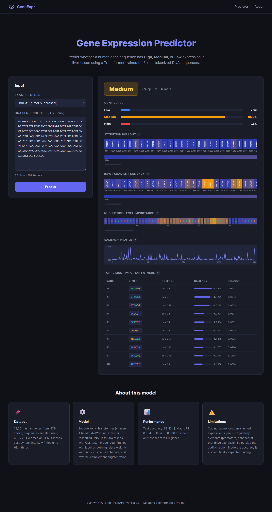

# Gene Expression Classification from DNA Sequences

A deep-learning system that predicts gene expression level (**Low / Medium / High**) directly from raw human DNA coding sequences. Built end-to-end: data pipeline → custom Transformer model → interpretability tools → web interfaces.

> Master's project (Bioinformatics, AIUB) — Arnab Satyam Roy

---

## Highlights

- **Custom encoder-only Transformer** with 6-mer k-mer tokenization
- **End-to-end data pipeline** combining NCBI gene sequences with GTEx tissue expression
- **FastAPI web app** with HTML/CSS/JS frontend and JSON REST API
- **Interpretability tools** — attention rollout (Abnar & Zuidema, 2020) and input-gradient saliency
- **12,052 labelled human genes**, three balanced classes
- Final test accuracy **63.4 %**, macro-F1 **0.634**, AUROC **0.806**

## Demo



> Interactive prediction served by FastAPI, with attention-rollout and saliency heatmaps

---

## Results

| Metric            | Value |
|-------------------|-------|
| Test accuracy     | **0.634** |
| Macro F1          | **0.634** |
| AUROC (one-vs-rest) | **0.806** |
| Test set size     | 2,411 genes |


Confusion matrix and per-class metrics are saved to `outputs/` after running `python evaluate.py`.

---

## Project Structure

```
gene-expression-lm/
├── train.py                     # Training script
├── evaluate.py                  # Test-set evaluation & metrics
├── interpret.py                 # Attention / saliency visualisations
├── run_pipeline.py              # One-shot data-pipeline orchestrator
├── launch.bat                   # Windows launcher (opens browser + starts FastAPI)
├── requirements.txt
│
├── data/                        # Data acquisition and processing
│   ├── download_ncbi.py         # Fetch human gene coding sequences
│   ├── download_gtex.py         # Fetch GTEx per-tissue median TPM
│   ├── map_ids.py               # Ensembl ↔ HGNC symbol mapping (MyGene.info)
│   ├── build_dataset.py         # Join sequences + expression → labels
│   └── labeled_genes.csv        # Final labelled dataset (12,052 genes)
│
├── models/
│   └── transformer_model.py     # Encoder-only Transformer + interpretability
│
├── preprocess/
│   └── tokenizer.py             # K-mer tokenizer + train/val/test splitter
│
├── checkpoints/                 # Trained model weights & test artefacts
│   ├── transformer.pt
│   ├── transformer_test_seqs.npy
│   └── transformer_test_labels.npy
│
├── outputs/                     # Evaluation results & figures
│   ├── eval_results.csv
│   └── confusion_transformer.png
│
└── web/                         # FastAPI backend
    ├── main.py
    └── static/                  # index.html, app.js, style.css
```

---

## Installation

Requires **Python 3.10+**.

```bash
# 1. Clone
git clone https://github.com/arnabsroy9/gene-expression-lm.git
cd gene-expression-lm

# 2. Create and activate a virtual environment
python -m venv venv

# Windows:
venv\Scripts\activate
# Linux / macOS:
source venv/bin/activate

# 3. Install dependencies
pip install -r requirements.txt
```

GPU is optional. Training without a GPU is slow (~10 min/epoch on a modern laptop CPU); inference and the web app run comfortably on CPU.

---

## Quick Start

The repository ships with a pre-trained checkpoint, so you can skip directly to evaluation or the demo:

```bash
# Launch the web app (FastAPI + static frontend)
python web/main.py
# → http://127.0.0.1:8000

# Or on Windows, double-click launch.bat to open the browser and start the server.

# Evaluate the trained checkpoint on the held-out test set
python evaluate.py

# Generate attention & saliency visualisations for example genes
python interpret.py --gene BRCA1
python interpret.py --gene TP53
python interpret.py --n_examples 3   # random test-set samples
```

---

## Reproducing from Scratch

```bash
# 1. Build the labelled dataset (downloads ~50 MB, runs once)
python run_pipeline.py

# 2. Train the Transformer (≈30 epochs)
python train.py --epochs 30 --batch_size 16

# 3. Evaluate
python evaluate.py
```

Training options:

```bash
python train.py --task classification --epochs 30 --batch_size 16 --lr 1e-3
python train.py --task regression                  # predict log-TPM directly
python train.py --data path/to/custom.csv          # alternate labelled CSV
python train.py --max_len 2000                     # override sequence-length cap
```

---

## Data Pipeline

The pipeline produces `data/labeled_genes.csv` from public sources:

1. **NCBI gene sequences** — human protein-coding sequences (filtered to ACGT only, ≤ 1,000 bp) via the [GenerativeLM-Genes](https://github.com/boun-tabi/GenerativeLM-Genes) dataset.
2. **GTEx v8 median TPM** — tissue-specific expression values (default tissue: Liver; configurable with `--tissue`).
3. **Ensembl ↔ HGNC mapping** — gene-symbol harmonisation via the [MyGene.info](https://mygene.info/) REST API.
4. **Joining & labelling** — log-transform expression, rank-percentile binning into three balanced classes (Low / Medium / High at the 33rd and 67th percentiles).

Final dataset columns:

| Column            | Description |
|-------------------|-------------|
| `gene_id`         | NCBI gene ID |
| `gene_symbol`     | HGNC symbol |
| `sequence`        | DNA coding sequence (A/C/G/T) |
| `median_tpm`      | Raw GTEx median TPM |
| `log_tpm`         | `log(median_tpm + 1)` |
| `expression_label`| `Low` / `Medium` / `High` |

---

## Model Architecture

Encoder-only Transformer with pre-LayerNorm:

```
Input sequence (DNA, up to 1,000 bp)
        │
        ▼
6-mer k-mer tokenizer  (vocab = 4,098)
        │
        ▼
Token embedding + sinusoidal positional encoding   (d_model = 128)
        │
        ▼
TransformerEncoderLayer × 4
   • 4 attention heads
   • feedforward dim = 256
   • dropout = 0.1, pre-LN
        │
        ▼
LayerNorm → Dropout → Linear(d_model → num_classes)
        │
        ▼
Logits  (3 classes)
```

**Training tricks**

- Class-weighted cross-entropy loss with label smoothing (α = 0.1)
- Reverse-complement sequence augmentation (p = 0.5) for strand invariance
- AdamW optimiser (lr = 1 × 10⁻³, weight decay = 1 × 10⁻⁴)
- Linear LR warmup (3 epochs) followed by cosine annealing
- Gradient clipping at ‖g‖ = 1.0

For the regression head, cross-entropy is replaced by Huber loss; binning thresholds learned from the training set are saved alongside the checkpoint and applied at evaluation time.

---

## Interpretability

`interpret.py` produces two visualisations per gene:

1. **Attention rollout** — propagates attention across layers (Abnar & Zuidema, *ACL 2020*) to score each 6-mer's contribution to the CLS-token representation.
2. **Input × gradient saliency** — gradient of the predicted class score with respect to the embedded input.

Both visualisations are exported as PNG heatmaps annotated with the underlying 6-mer at every position.


```bash
python interpret.py --gene BRCA1
python interpret.py --sequence ATCG...     # custom DNA string
python interpret.py --n_examples 5         # five random test-set samples
```

---

## Web Application

Launched via `python web/main.py` (or `launch.bat` on Windows). Serves at **http://127.0.0.1:8000**.

**Frontend** — a static HTML / CSS / JS UI in `web/static/`:
- Paste a DNA sequence (or pick a pre-loaded example: **BRCA1**, **TP53**, **ACTB**)
- View prediction, class-probability bars, attention-rollout heatmap, and saliency heatmap

**REST API endpoints:**

| Method | Endpoint    | Description |
|--------|-------------|-------------|
| `GET`  | `/`         | Serves the static frontend |
| `POST` | `/predict`  | Accepts `{"sequence": "ATCG..."}` → returns prediction + interpretability data |
| `GET`  | `/health`   | Model-status health check |

---

## Dependencies

Core libraries (see `requirements.txt` for exact versions):

| Stack         | Packages |
|---------------|----------|
| Deep learning | `torch`, `transformers`, `datasets` |
| Data / biology| `pandas`, `numpy`, `biopython`, `mygene`, `requests` |
| ML baselines  | `scikit-learn` |
| Visualisation | `matplotlib`, `seaborn` |
| Web UI        | `fastapi`, `uvicorn` |
| Utilities     | `tqdm`, `scipy` |

---

## License & Citation

This project was developed as part of an MSc thesis at AIUB. The Transformer architecture is original to this project; data sources (NCBI, GTEx, MyGene.info, Ensembl) are public and used in accordance with their respective terms.

---

## Acknowledgements

- **GTEx Consortium** — bulk RNA-seq median-TPM tables (v8)
- **NCBI** — gene annotations and coding sequences
- **MyGene.info** — Ensembl → HGNC mapping API
- **Abnar & Zuidema (2020)** — attention-rollout interpretability method
